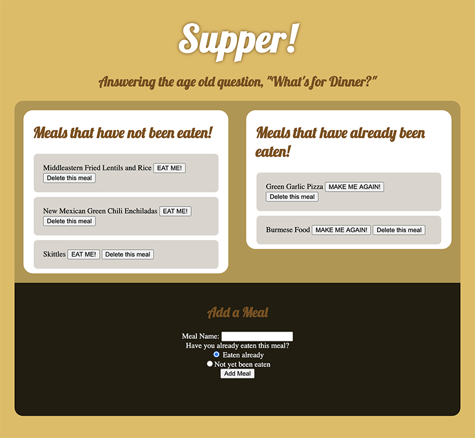

# Supper!
An MVC application using Express Handlebars, and a custom ORM in node.js

# Table of contents
1. [Usage](#Usage)
2. [Live Demo](#Live_Demo)
3. [User Story](#User_Story)
4. [Features](#Features)
5. [Technology](#Technology)
5. [Badges](#Badges)
7. [Credits](#Credits)
8. [License](#License)



<a name="Usage"></a>
## Usage
```sh
node server
```
<a name="Live_Demo"></a>
## Live Demo
https://fierce-oasis-15914.herokuapp.com/

<a name="User_Story"></a>
## User Story
```sh
As a human, 
I need to keep track of which meals I've eaten 
this week, and which I still have to eat
```


<a name="Features"></a>
## Features
1. Lists this week's meals
2.  change each meal's eaten status
3.  add a new meal
4.  delete a meal
<a name="Technology"></a>
## Technology
1. NODE.js
2.  MySQL
3.  Express
4.  Handlebars
5.  custom ORM


<a name="Badges"></a>
## Badges
 [](https://shields.io/)

<a name="Credits"></a>
## Credits
b0rgBart3@gmail.com

<a name='License'></a>
## License
[](https://lbesson.mit-license.org/)


**on github:** <a href='github.com/b0rgBart3'>b0rgBart3</a>

[](https://github.com/remarkablemark)

Email: borgBart3@gmail.com
